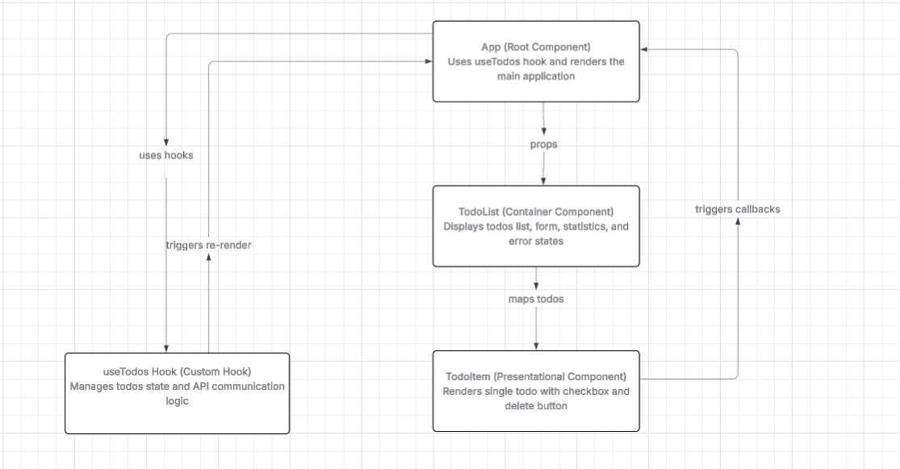

### Використані Патерни

**1. Custom Hooks Pattern**
Логіка роботи з todos винесена в окремий хук useTodos(). Це дозволяє повторно використовувати логіку та відокремити бізнес-логіку від UI.

**2. Optimistic UI Updates**
UI оновлюється миттєво, до отримання відповіді від API. При помилці зміни відкочуються назад. Це робить інтерфейс швидким та responsive.

**3. Container/Presentational Components**
App - "розумний" компонент з логікою, TodoItem - "тупий" компонент тільки для відображення. Чіткий поділ відповідальності.

**4. Controlled Components**
Форма додавання todo контролюється через React state. React є єдиним джерелом правди для значень форми.

**5. Single Responsibility Principle**
Кожен компонент має одну чітку відповідальність: App управляє станом, TodoList відображає список, TodoItem відображає один todo.

### Виявлені Антипатерни

**1. Props Drilling**
Callback функції (onToggle, onDelete) передаються через кілька рівнів: App → TodoList → TodoItem. Це ускладнює підтримку коду.

**2. Silent Failures**
Функція toggleTodo не показує помилки користувачу, тільки логує в консоль. Користувач не знає, що операція не вдалась.

**3. Inconsistent Error Handling**
addTodo та deleteTodo показують помилки користувачу, а toggleTodo - ні. Непослідовна поведінка плутає користувача.

**4. No Loading States for Individual Operations**
Є тільки глобальний loading, немає індикаторів для окремих операцій. Неможливо заблокувати повторні кліки на конкретний todo.

**5. Mixed Concerns in TodoList**
TodoList робить занадто багато: відображає список, управляє формою, рахує статистику, показує помилки. Потрібно розбити на окремі компоненти.